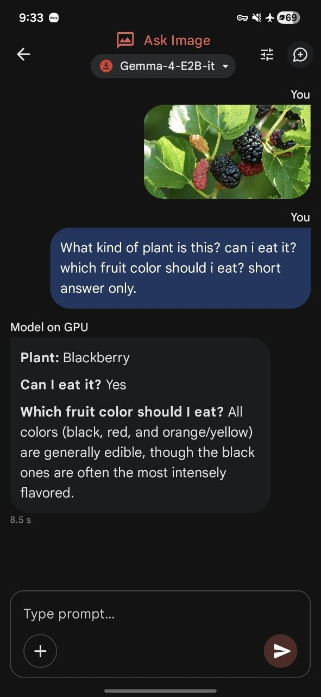

# Gemma 4 Is Here — Google's Newest Open-Weight Models

**Google DeepMind released Gemma 4 recently — April 2, 2026.**

I've been scrolling through tech news and forums waiting for something new to come up. Finally, it dropped. I've been tracking the open-weight LLM space closely, and this is also one of the open-weight models that I've been waiting for and can't wait to talk about. Four new models dropped on April 2, all Apache 2.0:
- **E2B** (effective ~2B) — tiny, efficient, runs on almost anything
- **E4B** (effective ~4.5B) — the sweet spot for laptops and phones  
- **26B MoE** (4B active) — high quality, fast inference
- **31B dense** — the big one, maximum capability

And yes, they're all multimodal now. Images, video, audio — built in from the start, not bolted on later.

---

## What's New?

### Multimodal Without the Hassle

Gemma 4 just works with images and audio out of the box. No "oh right I need to load a separate vision model first." The models natively understand:
- Images (variable aspect ratios, flexible token budgets)
- Audio (speech recognition on E2B/E4B)
- Video (end-to-end reasoning)

This is useful if you're deploying on-device and don't want to juggle multiple models. One model does everything.

### Math & Reasoning Got Better

The 31B dense model hit **89.2% on AIME 2026**. That's competitive with the best closed-weight models at this size. Instruction following is also noticeably sharper — less "I think you mean..." and more just doing it.

### Agentic Capabilities

Gemma 4 was built from the ground up for autonomous agents. Key features:

- **Native function calling** — structures API calls correctly, no guessing games
- **Structured JSON output** — clean, parseable responses (no regex hell)
- **Multi-step planning** — breaks complex tasks into executable steps
- **t2-bench score: 86.4%** — competitive with much larger models

Google built this to power Android Studio's Agent Mode, but it works anywhere you need tools and APIs. It's genuinely good at multi-step workflows, not just chat.

---

## So, How Does It Stack Up? (Gemma 4 vs Qwen3.5)

Alright, let's talk numbers because I know you're curious. I have a feeling Qwen3.5 27B will still be my go-to for coding — so I dug up some benchmark results to see if my hunch holds water. Spoiler: it does, but with a twist.

### The Benchmarks (TL;DR)

**Gemma 4 31B Dense vs Qwen3.5-27B Dense**

| Benchmark | Gemma 4 31B | Qwen3.5-27B | Winner |
|-----------|-------------|-------------|--------|
| MMLU-Pro (knowledge) | 85.2% | **86.1%** | Qwen ✅ |
| GPQA Diamond (science) | 84.3% | **85.5%** | Qwen ✅ |
| LiveCodeBench v6 (coding) | 80.0% | **80.7%** | Qwen ✅ |
| Tau2 (agent tasks) | 76.9% | **79.0%** | Qwen ✅ |
| MMMLU (multilingual) | **88.4%** | 85.9% | Gemma ✅ |
| MMMU-Pro (vision+reasoning) | **76.9%** | 75.0% | Gemma ✅ |

**Gemma 4 26B MoE vs Qwen3.5-35B-A3B MoE**

| Benchmark | Gemma 4 26B-A4B | Qwen3.5-35B-A3B | Winner |
|-----------|-----------------|-----------------|--------|
| MMLU-Pro (knowledge) | 82.6% | **85.3%** | Qwen ✅ |
| GPQA Diamond (science) | 82.3% | **84.2%** | Qwen ✅ |
| LiveCodeBench v6 (coding) | **77.1%** | 74.6% | Gemma ✅ |
| Tau2 (agent tasks) | 68.2% | **81.2%** | Qwen ✅ |
| MMMLU (multilingual) | **86.3%** | 85.2% | Gemma ✅ |
| MMMU-Pro (vision+reasoning) | 73.8% | **75.1%** | Qwen ✅ |

### The Arena AI Leaderboard (Real Talk from Users)

I also checked Arena AI's open-source leaderboard — this is where people actually chat with these models and give them ratings:

| Model | ELO Score | Rank Among Open Models |
|-------|-----------|------------------------|
| Gemma 4 31B | **1452 ± 9** | #3 overall 🥉 |
| Qwen3.5-397B-A17B | 1449 ± 6 | #4 overall |
| Gemma 4 26B-A4B | **1441 ± 9** | #6 overall |
| Qwen3.5-122B-A10B | 1416 ± 6 | ~#8 |
| Qwen3.5-27B | 1404 ± 6 | ~#10 |
| Qwen3.5-35B-A3B | 1400 ± 6 | ~#11 |

### What This Means for Practitioners 🤔

**Static tests**: Qwen3.5-27B beats Gemma 4 31B in 4 out of 6 categories (coding, knowledge, science reasoning). The margins are small — like 0.7% to 1.2% — but consistent. If you're building tools that require precise reasoning or heavy coding, Qwen's got the edge.

**But here's where it gets interesting**: On Arena AI, Gemma 4 ranks *higher* than comparable Qwen models. The 31B variant is #3 overall at ELO 1452, while Qwen3.5-27B sits around #10 with 1404. That's a 48-point gap!

What does this mean? Users seem to prefer Gemma for:
- Casual conversation and back-and-forth chat
- Natural-sounding responses
- Feeling more "assistant-like" in practice

Meanwhile, Qwen feels... clunkier in dialogue mode, even though it's technically stronger on paper.

### My Verdict

**For coding-heavy workloads**: Still sticking with my gut — Qwen3.5-27B is the pick. LiveCodeBench lead + stronger agent behavior (Tau2) = better for actually writing code or building tools.

**For multimodal/multilingual edge use cases**: Gemma 4's native image/audio support and MMMLU strength might be worth the tradeoff. Especially if you're deploying on-device where conversation flow matters more than raw benchmark scores.

**Bottom line**: Benchmarks confirm my preference — Qwen3.5 is sharper on technical tasks. But if conversational smoothness is your priority, Gemma could feel better in real use. You should probably test both locally to see which one just *feels* right for your use case.

---

## Edge AI: What I Actually Tried on My Phone

Edge AI is about running models directly on your device — no internet required. This matters for anyone who needs AI to work offline, whether you're traveling through areas with poor connectivity or simply value privacy and speed.

I put Google's [AI Edge Gallery](https://play.google.com/store/apps/details?id=com.google.ai.edge.gallery) app to the test. It demonstrates how Gemma 4 can run locally on a phone, processing images and text without ever sending data to the cloud. The setup is straightforward: install the app, load the model, and you have an offline-capable assistant running entirely on your hardware.

### What Actually Works Offline

- Document Q&A (upload a PDF, ask questions)
- Image analysis (take a photo of a map, menu, error message)
- Audio transcription and translation
- Basic text generation for drafting or brainstorming

The tradeoff? Edge models prioritize speed and efficiency over raw intelligence. They're designed for quick, practical tasks — not to compete with the massive cloud models on complex reasoning. For emergency scenarios where you just need to understand something or draft a quick note without internet, they're surprisingly capable.

---

## Final Thoughts

Gemma 4 is impressive — especially for what it tries to do. Google's clearly aiming at the "AI assistant on your phone" use case, and the multimodal capabilities are a real differentiator. But if you're building something that demands precision (coding, technical reasoning), Qwen3.5 still edges it out.

The real winner here might be having both options available — pick whichever fits your workflow better.